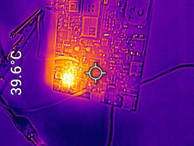
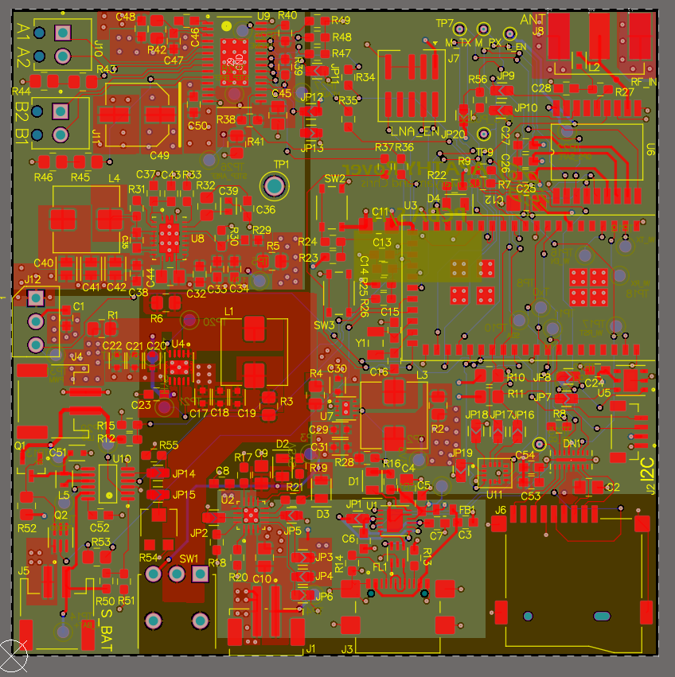
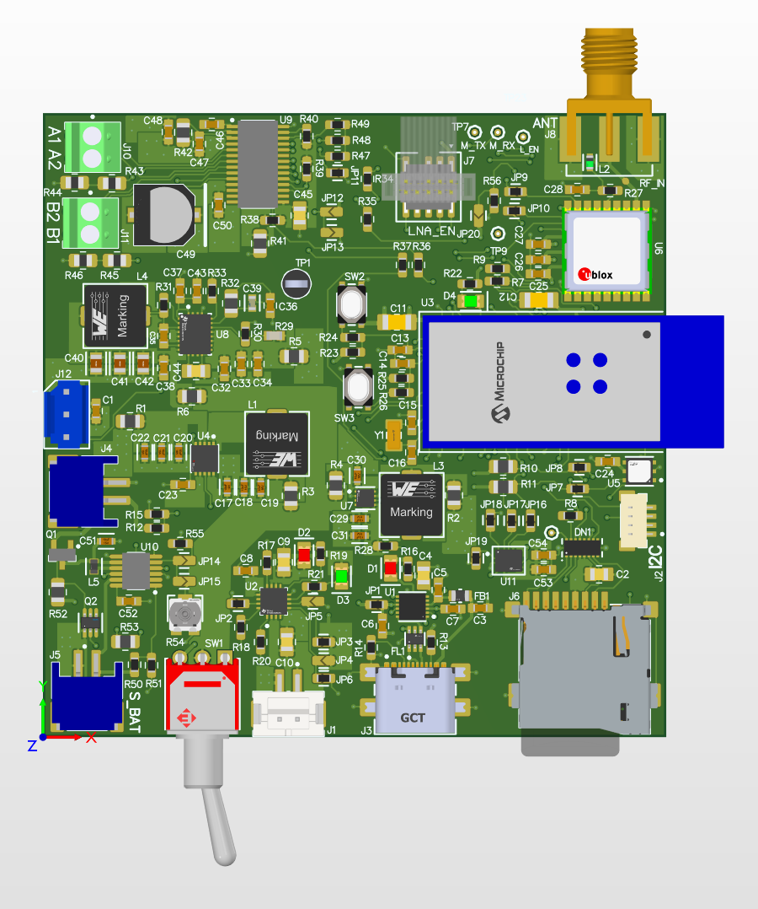
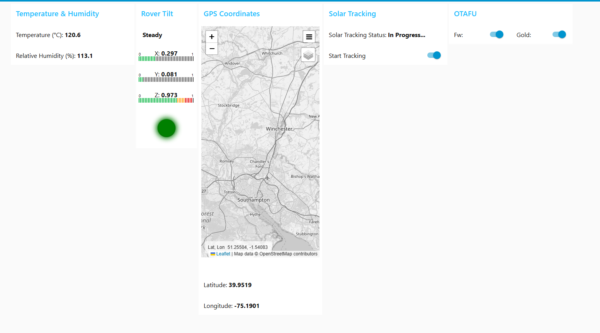
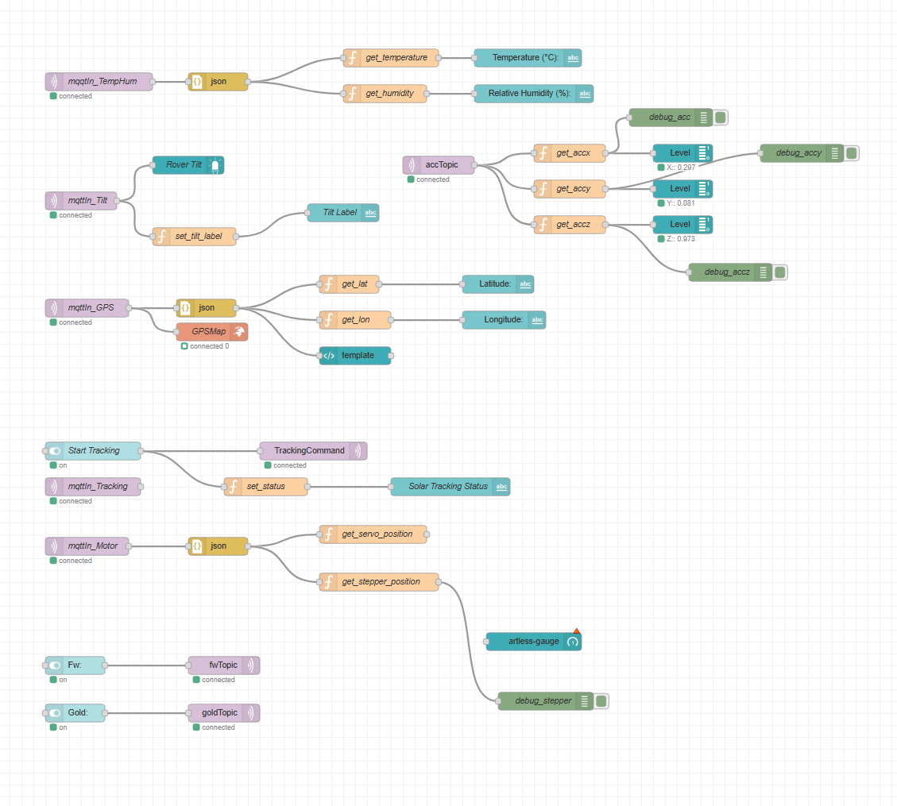

# a14g-final-submission

    * Team Number: 02
    * Team Name: Apathy
    * Team Members: Maryam Ali, Chris Connolly
    * Github Repository URL: https://github.com/ese5160/a14g-final-submission-s25-t02-a-p-a-t-h-y
    * Description of test hardware: (development boards, sensors, actuators, laptop + OS, etc) 

## 1. Video Presentation

## 2. Project Summary

### 1. Device Description

Apathy is a model space rover that aims to capture the considerances of space agencies when sending rovers to other planets. Our project was inspired by the team members' mutual interest for space technologies and desire to understand how various components interact to produce an autonomous information-collecting machine.

### 2. Device Functionality

Our PCBA consists of a multitude of sensing components such as a GPS for latitude/longitude coordinates, an IMU for tilt detection, a temperature and humidity sensor, and a solar cell as part of a larger solar tracking mechanism. It also integrates a stepper motor and servo motor for actuation of the solar cell. Our device communicates with the Node-RED dashboard through an intermediary MQTT broker, sending updated sensor information in real time and solar tracking commands back to the board. The system-level block diagram can be found [here]().

### 3. Challenges

Our team faced difficulties towards the later stages of the project when bringing up the board and writing firmware. Some of our boards had manufacturing defects, such as our board B's 3V3 buck, which we were able to bypass with a separate power IC. We also made small errors during design, such as misplaced bypass capacitors and incorrectly rated resistors, but these were easily remedied during testing and bring-up. When writing the firmware, we ran into issues with the number of tasks and memory concerns, which we were able to deal with by isolating memory-intensive tasks and prioritizing the product's core functionality.

### 4. Prototype Learnings

This project was a great learning opportunity for our team. Building our system from the ground up: picking relevant ICs, drawing the schematics, implementing the board layout, bringing up the board, and writing the firmware allowed us to have a complete and thorough understanding of the system. We learned about the importance of planning early and the consequences poor decision-making can impose on later stages of the project, such as choosing an IC with poor documentation. The challenge of working with 3 PCBAs and the finality of hardware mistakes taught us to work with extra caution when correcting mistakes on the board. We also learned about the challenges that come with introducing an RTOS to code and how to debug non-deterministic systems, forcing us to prioritize space efficiency.

If we could build the device again, we would integrate our ICs better to create a more cohesive product, as opposed to having separate channels of information-collection. This might have made tasks more complex, but it would reduce the total number of tasks and make priority and memory allocation more intuitive. Our team would also look further online before finalizing ICs and selecting ones that had more community support. Also, we would attempt to make better use of our MCU pins and pull out any that were unused as contingencies, such as using a pin for our solar cell voltage reference to expand the range.

### 5. Next Steps & Takeaways

In order to continue polishing our final product, we could refine our solar tracking mechanism and fine-tune the solar cell direction. We could also refine the casework of the product, using wire harnessing and cleaning up the board to have a cleaner final product.

In ESE 5160, we were able to apply topics like real-time scheduling, semaphores, board bring-up advice, and more on our physical boards. We learned about the challenge of working with real-time systems and were faced with more industry-level challenges such as a short timeframe and limited number of boards.

## 3. Hardware & Software Requirements

### HRS

**General**

| # | Requirement specification | Status |
| --------- | -------- | -------- |
| HRS-G-01 | The project shall use a SAMW25 as the central module. | ✅ |
| HRS-G-02 | The project shall use the WINC1500 to communicate with Node-red over Wi-Fi. | ✅ |
| HRS-G-03 | The project shall use the SAMD21 MCU to connect to a GPS, IMU, Temp/Humidity sensor, and ADCs. | ✅ |
| HRS-G-04 | The project shall use a battery of at least 4V that can power the MCU and electronics for an average of 5 hours. | Used a 4.2V battery (✅), will not last 5 hours (❌) |
| HRS-G-05 | The project shall have an on/off button to power the entire system. | ✅ |
| HRS-G-06 | The project shall use a boost converter to step-up the battery voltage to 12V to power the stepper motor driver. | ✅ (tested during board bringup assignment) |
| HRS-G-07 | The project shall use a boost converter to step-up the battery voltage to 5V to power the servo motor. | ✅ (tested during board bringup assignment) |
| HRS-G-08 | The project shall use a buck converter to step-down the battery voltage to 3.3V to power the MCU, GPS, temp/humidity, IMU, and other logic level high signals. | ✅ (tested during board bringup assignment) |

**Sensors**

| # | Requirement specification | Status |
| --------- | -------- | -------- |
| HRS-S-01 | The system shall use a temperature sensor to provide Celsius readings correct to a tenth of a degree. | ✅ (see Node-RED dashboard) |
| HRS-S-02 | The system shall use a humidity sensor to provide surrounding humidity readings as a percentage correct to 3SF. | ✅ (see Node-RED dashboard) |
| HRS-S-03 | The system shall use an IMU accelerometer and gyroscope to collect 3-dimensional readings with an accuracy of .5G and .1 deg/s respectively. | Collected accelerometer readings, see Node-RED dashboard (✅) but not gyroscope (❌)  |
| HRS-S-04 | The system shall use a GPS to provide the rover's location correct to 10 meters. | |
| HRS-S-05 | The GPS should provide latitude and longitude values correct to 3 decimal points. | ✅ |
| HRS-S-06 | The MCU shall communicate with the IMU and temp/humidity sensor over I2C.  | ✅ |
| HRS-S-07 | The system should combine all I2C peripherals on one I2C bus.  | ✅ |
| HRS-S-08 | The MCU shall communicate with the GPS over UART. | ✅ |

**Solar Tracking**

| # | Requirement specification | Status |
| --------- | -------- | -------- |
| HRS-ST-01 | The system shall incorporate a solar cell to collect and store energy into a rechargeable battery. | ✅ Incorporated a solar cell but ❌ did not charge battery |
| HRS-ST-02 | The system shall use an ADC to monitor the voltage of the solar cell. | ✅ |
| HRS-ST-03 | The system shall use a stepper motor to actuate solar cells 360 degrees around the y-axis in 10 degree increments. It will be controlled using a driver. | ✅ (we actuated in 36 degree increments) |
| HRS-ST-04 | The system shall use a servo motor to actuate solar cells 180 degrees around the z-axis in 10 degree increments. | ✅ (we actuated ~90 degrees) |
| HRS-ST-05| The system shall use a potentiometer to tune a MPPT IC | ❌ |
| HRS-ST-06 | The system shall use a MOSFET to complete the circuit from the solar cell to rechargeable battery after the ideal resistance is determined. | Our system contained a MOSFET (✅) but we did not use it to charge the battery (❌) |

**Wireless**

| # | Requirement specification | Status |
| --------- | -------- | -------- |
| HRS-W-01 | The WINC1500 will be used to send data packets containing peripheral data (GPS coordinates, temperature, humidity, tilt status, solar tracker charge, motor position) to the Node-red UI to be displayed. | ✅ (we sent GPS coordinates, tilt status, acceleration values, temperature and humidity readings) |

### SRS

**Sensors**

| # | Requirement specification | Status |
| --------- | -------- | -------- |
| SRS-S-01 | The system shall pull temperature and humidity data at a speed of 2Hz. | |
| SRS-S-02 | The system shall collect longitude and latitude values from the GPS at a speed of 2Hz and will be correct to .1 deg. | |
| SRS-S-03 | A calibration routine shall be run after initial start-up to identify the rest state of IMU. | ✅ |
| SRS-S-04 | Acceleration and gyration data will be collected from the IMU correct to .5G and .1 deg/s at a speed of 2Hz and further processing will be used to determine whether the rover has fallen over or not. | ✅ (used acceleration data to determine tilt) |
| SRS-S-05 | The system should apply the Haversine formula to the latitude and longitude values every 10 seconds to determine when the rover has moved at least 10 meters for solar tracking. | ❌ |

**Solar Tracking**

| # | Requirement specification | Status |
| --------- | -------- | -------- |
| SRS-ST-01 | The system should have a solar-tracking mode that is activated when the rover has moved at least 10 meters from its previous solar tracking point. | ❌ (switched to using a Node-RED button to start solar tracking) |
| SRS-ST-02 | The system shall determine the solar cell orientation and load for optimal charging within 1 minute. | ❌ (takes ~2 minutes) |
| SRS-ST-03 | The solar tracking system shall read ADC data to determine the voltage of each solar cell orientation in the y and z-axis. | ✅ |
| SRS-ST-04 | The firmware shall determine the maximum ADC reading in the y-direction and fix the corresponding stepper postion. | ❌ (see ** below) |
| SRS-ST-05 | The firmware shall determine the maximum ADC reading in the z-direction and fix the corresponding servo postion. | ❌ (see ** below) |
| SRS-ST-06 | The system shall fix the orientation of the solar cell and use the Maximum Power Point Tracking (MPPT) technique to identify load value for optimal battery charging. | ❌ (see ** below) |

** We changed our solar tracking algorithm to work as follows: 

**Node-red UI**

| # | Requirement specification | Status |
| --------- | -------- | -------- |
| SRS-NR-01 | The project shall have a Node-red UI. | ✅ |
| SRS-NR-02 | The UI shall have a display panel that shows the status of the rover's tilt. This value will either be "steady" or "toppled over". | ✅ (displayed tilt status as an LED) |
| SRS-NR-03 | The display panel shall report the temperature in Celsius. | ✅ |
| SRS-NR-04 | The display panel shall report the relative humidity as a percentage. | ✅ |
| SRS-NR-05 | The display panel shall display the GPS latitude and longitude correct to a tenth of a degree. | ✅ |
| SRS-NR-06 | The system should use Google Maps API to show the real-time position of the rover on a map interface. | ✅ (used webmap on Node-RED) |
| SRS-NR-07 | The display panel shall have an LED that changes color based on the battery voltage level. These levels will be high (green), medium (yellow), and low (red). | ❌ |
| SRS-NR-08 | The UI should update sensor values at least once every second. | ✅ (sensor values updated as they were individually sent from each task) |
| SRS-NR-09 | The system shall display the solar tracking status on the UI. | ❌ |
| SRS-NR-10 | Solar tracking status strings should include "Determining orientation...", "Computing load...", "Optimal charging achieved." | ❌ (did not display tracking status) |

## 4. Project Photos & Screenshots

**Final Product**

---

 
 

**PCBA**

---

 
 

**Thermal**

---

 
 

**Altium**

---

 
 

**Node-RED**

---

 
 

**System Block Diagram**

---

## Codebase

- Firmware Codebase:
    - Application: https://github.com/ese5160/final-project-t02-a-p-a-t-h-y/tree/main/Application
    
    - Bootloader: https://github.com/ese5160/final-project-t02-a-p-a-t-h-y/tree/main/Bootloader
- Node-RED dashboard: http://172.172.226.51:1880/#flow/f3c94055431b0493 (make sure to check Flow 2, not Flow 1)